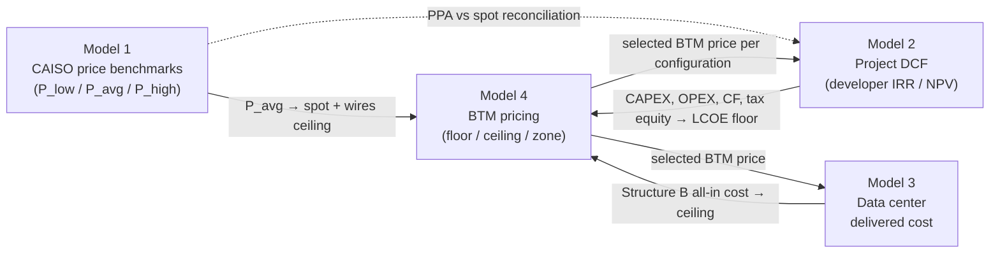

# Model Guide: SPUR Co-location Financial Model (v8)

This guide documents `models/SPUR_Combined_Model_v8.xlsx`, the model behind Working Paper Draft 3 (October 2026). It explains what each of the four models does, how they connect, the key formulas, every major assumption and its source, and the base-case results.

All figures below are the **base case** stored in the v8 workbook unless stated otherwise:
- grid connection delay of 4 years
- 30% ITC
- BTM price taken from Model 4
- baseline = construction deferred

Results are preliminary and will change as the open items in [Section 9](#9-limitations-and-open-items) are resolved.

---

## Contents

1. [The question and the two scenarios](#1-the-question-and-the-two-scenarios)
2. [How the four models fit together](#2-how-the-four-models-fit-together)
3. [Model 1: CAISO electricity price benchmark](#3-model-1-caiso-electricity-price-benchmark)
4. [Model 2: Project-level DCF with tax equity](#4-model-2-project-level-dcf-with-tax-equity)
5. [Model 3: Data center delivered cost](#5-model-3-data-center-delivered-cost)
6. [Model 4: Bilateral BTM pricing](#6-model-4-bilateral-btm-pricing)
7. [Figure data sheets](#7-figure-data-sheets)
8. [Running scenarios](#8-running-scenarios)
9. [Limitations and open items](#9-limitations-and-open-items)
10. [Version history](#10-version-history)

---

## 1. The question and the two scenarios

A renewable project in the CAISO interconnection queue can wait years between its interconnection request and commercial operation. The model compares two strategies for the developer.

| | **Baseline: wait** | **Co-location: build early** |
|---|---|---|
| Construction | Deferred until the grid connection is available | Starts immediately |
| During the grid delay | No project, no revenue | Sells output **behind the meter (BTM)** to an adjacent AI data center through a dedicated microgrid |
| After grid COD | Sells to the grid under a hybrid PPA ($72/MWh) | Switches to the grid PPA ($72/MWh) |
| Extra cost | None | Microgrid CAPEX and O&M |

The question is two-sided:
- **Developer:** does co-location raise levered IRR and NPV relative to waiting?
- **Data center:** does co-located supply cost less than its grid alternative?

### Timeline (delay = *D* years, construction = 2 years)

```
Year:        0        1   2        3 … 2+D          2+D+1 …
Baseline:    (nothing until year D; then the same build-and-operate profile, shifted D years later)
Co-location: Equity | Construction | BTM sales (queue wait) | Grid operations ──►
```

**Baseline specification (v8).** `Inputs!B29` = 2 means the developer *does not build* until the grid connection is available. The baseline cash flows therefore look like a normal project, but they start *D* years later. To compare both scenarios at the same date, the baseline NPV is discounted back by *D* years (`Inputs!B31`). Because a pure time shift does not change an IRR, the baseline IRR is the same at every delay.

Setting `B29` = 1 reproduces the Draft 1 baseline instead: the project is built and then sits idle until COD.

---

## 2. How the four models fit together



The workbook's `_Index` sheet lists every tab. Colour convention: **blue** = hard-coded input, **green** = linked from another sheet, **yellow** = scenario lever.

| Model | Sheets |
|---|---|
| 1. Price benchmark | `M1_Inputs`, `M1_Benchmarks`, `M1_Scenarios`, `M1_Notes` |
| 2. Project DCF | `Inputs`, `Configurations`, `Capitalization`, `SolarBase`, `SolarColoc`, `WindBase`, `WindColoc`, `GeoBase`, `GeoColoc`, `Results` |
| 3. Data center cost | `M3_Inputs`, `M3_Coverage`, `M3_StructA_B`, `M3_StructC`, `M3_Results` |
| 4. BTM pricing | `M4_LCOE`, `M4_Bounds`, `M4_Pricing`, `M4_Notes` |
| Figures | `Fig2_Breakeven`, `Fig3_Zone`, `Fig4_Alpha` |

---

## 3. Model 1: CAISO electricity price benchmark

**Purpose:** establish what wholesale electricity is worth in California under low, average, and high net-load conditions, with optional carbon-price overlays.

### Data

All inputs come from **CAISO Department of Market Monitoring (DMM)** publications. Every cell cites its report and page in `M1_Inputs`. The sources are:
- 2024 and 2025 Annual Reports on Market Issues and Performance
- Q1–Q3 2024 and Q4 2025 quarterly reports, including the **Q3 2024 Table 3.3** hourly load-weighted 15-minute prices at the PG&E and SCE DLAPs
- Resurety (2025) for negative-price frequency and the SP15 solar capture rate

### Method

| Benchmark | Definition | Value |
|---|---|---|
| **P_low** | Mid-day solar trough, HE10–13, average of the PG&E and SCE DLAPs | **$24/MWh** |
| **P_avg** | Average of the 2024 and 2025 annual load-weighted day-ahead prices for the CA region ($41 and $39) | **$40/MWh** |
| **P_high** | Summer evening net-load peak, HE19–21, average of the PG&E and SCE DLAPs | **$89/MWh** |

The original proposal binned hours by system-load percentile. DMM does not publish prices binned that way, so the model uses **hour-of-day regimes** as a proxy. In CAISO, net load (load minus solar and wind) is driven mainly by the hour of day, so this proxy matches the economic intent of the original bins. The choice is a judgment call and is documented as one in `M1_Notes` §3.

### Carbon overlay

The marginal emission rate is back-calculated from DMM's own figures for the GHG cost of an efficient gas unit:

- 2024: $16.19/MWh ÷ $38.09/t
- 2025: $12.70/MWh ÷ $29.89/t

Both give **≈ 0.425 tCO₂e/MWh**. The carbon adder equals the incremental carbon price × 0.425:

| $/MWh | C0: status quo | C30: +$30/t | C60: +$60/t |
|---|---|---|---|
| LOW | 24 | 36.7 | 49.5 |
| AVERAGE | 40 | 52.7 | 65.5 |
| HIGH | 89 | 101.7 | 114.5 |

### Spot-to-PPA bridge

Model 2 uses a contracted **$72/MWh hybrid PPA** (LBNL), not a spot price. That PPA sits **$32 (80%) above P_avg**, a premium for firmed, shaped, long-term contracted supply. Model 1 provides the merchant-price alternatives (P_avg, P_high) as sensitivity cases.

### Main limitations

The hourly profile covers Q3 2024 only, so P_low and P_high are more extreme than a full-year profile would give. 2023 is excluded as a gas-price anomaly. `M1_Notes` §6 gives the code path for a full OASIS replication using the `gridstatus` Python library.

---

## 4. Model 2: Project-level DCF with tax equity

**Purpose:** compute the developer's levered IRR and NPV for each configuration under the baseline and co-location scenarios.

### 4.1 Configurations (`Configurations`)

| Parameter | Solar + BESS | Wind + BESS | Geothermal + BESS | Source |
|---|---|---|---|---|
| Capacity (MW) | 100 | 150 | 100 | Framework 2.2.1 |
| Capacity factor | 27.5% | 35% | 90% | NREL ATB 2024; Tehachapi wind; Salton Sea geothermal |
| Annual degradation | 0.5% | 0.2% | 0% | Framework 2.5.2 |
| Availability | 98% | 96% | 95% | Framework 2.5.2 |
| Electrical losses | 2.5% | 2.5% | 2.5% | Framework 2.5.2 |
| Total CAPEX ($mm) | 197.0 | 321.4 | 568.3 | NREL ATB 2024 midpoints + BESS + 4% development + land + interconnection |
| ITC-qualified investment ($mm) | 180.0 | 296.3 | 531.3 | Generation + BESS only |
| Microgrid CAPEX ($mm) | 12 | 18 | 12 | $120/kW (midpoint of $50–150/kW) |
| Fixed O&M ($mm/yr) | 3.0 | 6.4 | 4.6 | Framework 2.6 |
| Land lease + insurance ($mm/yr) | 1.09 | 1.59 | 2.57 | $0.3mm land + 0.4% of CAPEX |
| Microgrid O&M ($mm/yr) | 0.75 | 1.13 | 0.75 | $7.5/kW-yr |
| Operating life (years) | 25 | 25 | 30 | Framework 2.1 |

### 4.2 Global inputs (`Inputs`)

| Parameter | Value | Note / source |
|---|---|---|
| Grid connection delay | 4 years (lever: 2/4/6/8) | LBNL *Queued Up* 2025 |
| ITC rate | 30% (lever: 0% or 30%) | 0% = OBBBA "Scenario D" stress case |
| Credit type | ITC (lever: ITC or PTC) | PTC = $15/MWh for 10 years |
| Grid hybrid PPA price | $72/MWh | LBNL *Utility-Scale Solar* |
| BTM PPA price | From Model 4 (switch `B27`; flat $60 if `B27` = 1) | $60 = ~17% discount to the energy PPA, the industry convention |
| BESS delivery loss | 1% of BTM energy | Annual approximation of round-trip losses |
| Debt | 5.5% interest, 20-year tenor, DSCR 1.35, max leverage 55% | Framework 2.3.1, 2.7 |
| Tax rate | 29.84% (21% federal + 8.84% CA) | |
| Tax equity | Pays $0.80 per $1 PV of ITC + PTC + MACRS shield | |
| Partnership flip | Year 6; developer cash share 70% before the flip, 97.5% after; $1mm buyout | Framework 2.8.2 |
| Construction | 2 years | Framework 2.1 |
| NPV discount rate | 8% (WACC) | Framework 2.9.3 |
| Asset management | 1.5% of revenue | Framework 2.6 |

### 4.3 Capitalization (`Capitalization`)

Each of the six cases (3 configurations × baseline / co-location) is financed by a capital stack. Total capital = CAPEX, plus microgrid CAPEX for co-location.

1. **Senior debt** = MIN(DSCR-sized debt, 55% × total capital)
   - DSCR-sized debt = PV over 20 years at 5.5% of (first grid-year EBITDA ÷ 1.35)
   - The 55% leverage cap binds for wind and geothermal.
2. **Tax equity** = 0.80 × (ITC + PV of PTC + PV of MACRS tax shield)
   - ITC = rate × qualified investment
   - With the ITC, the depreciable basis = qualified investment − ½ × ITC.
   - MACRS uses the 5-year schedule (20 / 32 / 19.2 / 11.52 / 11.52 / 5.76%), discounted at 7%.
3. **Developer equity** = total capital − debt − tax equity. This is the residual the developer puts in at year 0.

| $mm (base case) | Solar base | Solar coloc | Wind base | Wind coloc | Geo base | Geo coloc |
|---|---|---|---|---|---|---|
| Total capital | 197.0 | 209.0 | 321.4 | 339.4 | 568.3 | 580.3 |
| Senior debt | 108.3 | 101.7 | 176.8 | 186.7 | 312.5 | 319.1 |
| Tax equity | 73.6 | 73.6 | 121.1 | 121.1 | 217.1 | 217.1 |
| **Developer equity** | **15.1** | **33.7** | **23.5** | **31.6** | **38.6** | **44.0** |

Co-location needs more developer equity because the microgrid adds capital. For solar, the extra O&M also lowers EBITDA and therefore the DSCR-sized debt.

**PTC timing.** Under the PTC pathway, the co-location case starts claiming credits at mechanical completion. This assumes BTM operation counts as "placed in service", an assumption that should be checked against IRS guidance.

### 4.4 Annual cash flow waterfall (`SolarBase` … `GeoColoc`)

The six sheets share the same structure, one row per year:

```
Net energy (MWh)  = MW × CF × 8760 × (1 − degradation)^(op year) × availability × (1 − losses)
Revenue           = queue-wait years (co-location only): energy × (1 − BESS loss) × BTM price
                    grid years: energy × $72
OPEX              = fixed O&M + land/insurance (+ microgrid O&M for co-location) + 1.5% × revenue
EBITDA            = Revenue − OPEX
Debt service      = level annuity for 20 years after construction
Distributable     = EBITDA − debt service
Developer cash    = Distributable × developer share (70% to the flip year, 97.5% after) − buyout at the flip
```

Outputs at the top of each sheet:
- **developer levered IRR** on developer cash
- **unlevered project IRR** on EBITDA, with the full CAPEX at year 0
- **developer NPV** at 8%, discounted to a common date

### 4.5 Results (`Results`)

| Base case | Solar + BESS | Wind + BESS | Geothermal + BESS |
|---|---|---|---|
| BTM price in use (from Model 4) | $121.26 | $116.35 | $108.93 |
| Baseline levered IRR | 12.6% | 18.9% | 25.1% |
| Co-location levered IRR | 11.8% | 24.4% | 33.1% |
| **Δ IRR** | **−0.8 pp** | **+5.5 pp** | **+8.0 pp** |
| Baseline developer NPV ($mm) | 8.0 | 33.3 | 111.3 |
| Co-location developer NPV ($mm) | 11.7 | 58.3 | 186.7 |
| **Δ NPV ($mm)** | **+3.8** | **+24.9** | **+75.4** |

The **value bridge** (rows 12–19) breaks the co-location gain into its parts:
- extra revenue earned during the queue wait
- extra EBITDA
- extra developer cash

It sets these against the microgrid CAPEX and the additional developer equity. For example, solar earns $37mm of extra developer cash during a 4-year wait, against $18.6mm of extra equity.

For solar, NPV rises while IRR falls slightly. Co-location needs more than twice the developer equity ($33.7mm vs $15.1mm), which dilutes the percentage return even though the dollar value goes up.

The **scenario sweep tables** (rows 24–55) are static values at a flat $60 BTM price. At $60, co-location *lowers* IRR for every configuration, ITC case, and delay. This is the main result reported in Paper Section 4.2.

---

## 5. Model 3: Data center delivered cost

**Purpose:** compare what a 100 MW AI data center (90% load factor, ≈ 788 GWh/yr) pays for electricity under three supply structures.

### Structures

| Structure | Description | All-in cost |
|---|---|---|
| **A: Utility tariff** | PG&E Schedule B-20 Primary, bundled (rates as of March 2026) | **$236.91/MWh** |
| **B: Sleeved grid PPA** | Energy PPA + transmission + non-bypassable charges + resource adequacy + ancillary services + scheduling + shaping | **$162.82/MWh** |
| **C: BTM co-location** | BTM energy for the covered share + backup or grid for the rest + fees | depends on configuration (below) |

Structure B build-up ($/MWh):

| Component | Value | Status |
|---|---|---|
| PPA energy price | 70.00 | placeholder |
| CAISO HV Transmission Access Charge | 15.58 | sourced (CAISO, Jan 2026) |
| Non-bypassable charges (PCIA, wildfire, etc.) | 23.00 | placeholder (from PG&E rate comparison) |
| Resource adequacy | 45.24 | sourced: $25.19/kW-mo × (1 + 18% PRM) × 12 ÷ MWh |
| Ancillary services + GMC | 1.50 | placeholder |
| Scheduling coordinator | 0.50 | placeholder |
| Shaping / imbalance | 7.00 | placeholder |
| **Total** | **162.82** | |

### Coverage

Coverage = MIN(1, annual net generation ÷ annual data center demand). This is an **annual energy balance, not an hourly dispatch**.

| | Solar | Wind | Geothermal |
|---|---|---|---|
| Coverage ratio | 28.9% | 55.0% | 96.7% |

### Structure C

- **Phase 1 (islanded, during the queue wait):** the uncovered share is served by diesel backup at $300/MWh (placeholder).
- **Phase 2 (grid-connected):** the uncovered share is bought at PPA + TAC + NBC, plus a standby charge.

| $/MWh | Solar | Wind | Geothermal |
|---|---|---|---|
| Phase 1 all-in | 234.7 | 172.6 | 73.4 |
| Phase 2 all-in (placeholder BTM price $62) | 103.6 | 91.5 | 72.1 |

The **H2 test** (data center saves ≥ 20% vs Structure B) passes in Phase 2 for all three configurations. In Phase 1 it passes only for geothermal: solar and wind cover too little of the load, and expensive diesel backup fills the gap.

---

## 6. Model 4: Bilateral BTM pricing

**Purpose:** find the range of BTM prices that both parties would accept, and pick a base-case price.

### 6.1 Floor: developer LCOE (`M4_LCOE`)

LCOE uses a closed form with degradation:

$$
\text{LCOE} = \frac{\text{CAPEX} + \text{OPEX}\times \text{PVA}(r,N)}{E_1 \times \dfrac{q\,(1-q^N)}{1-q}}, \qquad q = \frac{1-d}{1+r}
$$

Here r = 8%, N = operating life, d = degradation, and E₁ = year-1 net energy.

| $/MWh | Solar | Wind | Geothermal |
|---|---|---|---|
| Gross LCOE, co-location (no credit) | 111.04 | 96.73 | 81.46 |
| **Net LCOE, co-location (net of tax equity): base floor** | **79.70** | **69.89** | **55.05** |

These LCOEs are higher than NREL ATB generation-only ranges because they include storage, microgrid, land, and interconnection. This is by design: the floor has to cover the whole project.

### 6.2 Ceilings (`M4_Bounds`)

| Ceiling | Definition | $/MWh |
|---|---|---|
| **A: all-in (base)** | Model 3 Structure B delivered cost | **162.82** |
| B: energy-only | Grid hybrid PPA | 72.00 |
| C: spot + wires | P_avg + TAC + NBC | 78.58 |

The gap between ceilings A and B, **$90.82/MWh**, is the pool of avoided transmission, distribution, and capacity costs that the two parties split.

### 6.3 Price-setting methods (`M4_Pricing`)

| Method | Formula | Solar | Wind | Geo |
|---|---|---|---|---|
| 1. Midpoint | (floor + ceiling A) ÷ 2 | 121.26 | 116.35 | 108.93 |
| 2. Industry convention | $72 × (1 − 15%) | 61.20 | 61.20 | 61.20 |
| **3. Bargaining share α (selected; α = 0.5)** | floor + α × (ceiling A − floor) | **121.26** | **116.35** | **108.93** |

Method 2 prices solar and wind **below their LCOE**. Methods 1 and 3 price in the data center's avoided wires and capacity costs. The selected price (`B18`) feeds back into Model 2 through `Configurations!B16`.

### 6.4 Two-sided viability and the acceptable range

At the selected price:
- the developer clears its 10% IRR hurdle for all three configurations
- the data center saves **25.8% / 25.5% / 27.9%** relative to Structure B

**Analytical range.** P_max is the price at which the data center's savings fall exactly to 20%. P_min is the LCOE floor.

| $/MWh | Solar | Wind | Geothermal |
|---|---|---|---|
| P_min (LCOE floor) | 79.70 | 69.89 | 55.05 |
| P_max (data center 20% savings) | 154.19 | 132.54 | 122.21 |
| **Range width** | **74.50** | **62.65** | **67.16** |

Solar has the widest range for a counter-intuitive reason. Its 29% coverage means the BTM price makes up only a small part of the data center's blended cost, so the data center barely notices a higher solar price.

---

## 7. Figure data sheets

| Sheet | Paper figure | Type |
|---|---|---|
| `Fig2_Breakeven` | Levered IRR vs grid delay (1–8 years): BTM lever (flat $60 vs Model 4 price) × ITC (0% / 30%), all three configurations | **Static values** pasted from full model runs |
| `Fig3_Zone` | Stacked bar of LCOE floor, acceptable range, rest of zone, and the $60 marker | **Live**, linked to Model 4 |
| `Fig4_Alpha` | Developer IRR and data center savings vs bargaining share α (0 to 0.8) | **Static values** |

Breakeven delays read from `Fig2_Breakeven` (30% ITC, Model 4 price): co-location beats waiting once the delay exceeds about **4 years for solar** and **2 years for wind**, and at **every delay tested for geothermal**.

To refresh a static sheet, set the levers in `Inputs`, read the IRRs from `Results`, and paste the values in.

---

## 8. Running scenarios

| What you want to test | Change |
|---|---|
| Different grid delay | `Inputs!B5` |
| No federal credit (OBBBA stress case) | `Inputs!B6` = 0 |
| PTC instead of ITC | `Inputs!B7` = 2 |
| Flat industry BTM price | `Inputs!B27` = 1 (uses `Inputs!B19`, default $60) |
| Old (Draft 1) baseline: build, then sit idle | `Inputs!B29` = 1 |
| Different pricing method | `M4_Pricing!B18` = 1, 2 or 3 |
| Bargaining power | `M4_Pricing!B5` (α, 0–1) |
| Data center size | `M3_Inputs!B4` |
| Carbon price scenario | See `M1_Scenarios` (not yet wired into the ceiling) |

Everything recalculates live except the static sweep tables in `Results` rows 24–55, `Fig2_Breakeven`, and `Fig4_Alpha`.

---

## 9. Limitations and open items

1. **Annual, not hourly.** Coverage is an annual energy balance. Battery losses are a flat 1%. The shaping cost of matching variable renewable output to a flat data center load is a $7/MWh placeholder, not the output of a dispatch model.
2. **Model 3 placeholders.** The following inputs in `M3_Inputs` are still marked *Placeholder*:
   - data center load factor
   - net capacity factors
   - non-bypassable charges
   - Structure B PPA price
   - BTM price used inside Model 3
   - ancillary services, scheduling, and shaping costs
   - diesel backup cost
   - standby charge
3. **Model 3 uses its own BTM price.** `M3_Inputs!B25` is a $62 placeholder. `M4_Pricing` already computes the data center's Phase 2 cost at the selected price, but Structure C in Model 3 is not yet linked to it.
4. **Single 8% WACC.** A lower-risk geothermal project might justify a lower discount rate, which would widen its pricing zone.
5. **α is a lever, not an estimate.** The bargaining share should eventually be informed by practitioner interviews.
6. **Carbon scenarios are not wired in.** C30 and C60 would raise ceilings A and C by about $13 and $26/MWh.
7. **Regulatory assumptions.** These include whether BTM operation counts as "placed in service" for tax credits, how the PPA handles the transition to grid service, and whether a microgrid arrangement triggers utility or CPUC jurisdiction. All of these need legal review.
8. **Partly stale notes.** Some text in `M4_Notes` (§3 unlevered IRRs, §7a–b) describes v7, before the Model 4 → Model 2 link was closed. The live sheets are authoritative.

---

## 10. Version history

| Version | Main changes |
|---|---|
| Preliminary v3 | Single-workbook prototype: Solar + BESS and Wind + BESS selected one at a time via a configuration switch; developer levered IRR |
| Preliminary v5 | Adds Geothermal + BESS, unlevered IRR, and developer NPV |
| Preliminary v7 | All three configurations side by side (six waterfalls), global levers |
| Model 3 DC Cost v1 | Stand-alone data center delivered-cost model (Structures A / B / C) |
| Combined v7 | Merges Models 1–4 and the figure data into one workbook; adds the Model 4 → Model 2 BTM price switch |
| **Combined v8** | Baseline re-specified as **construction deferred** (Draft 2 §2.1), with baseline NPV discounted to a common date; results re-run for Working Paper Draft 3 |
